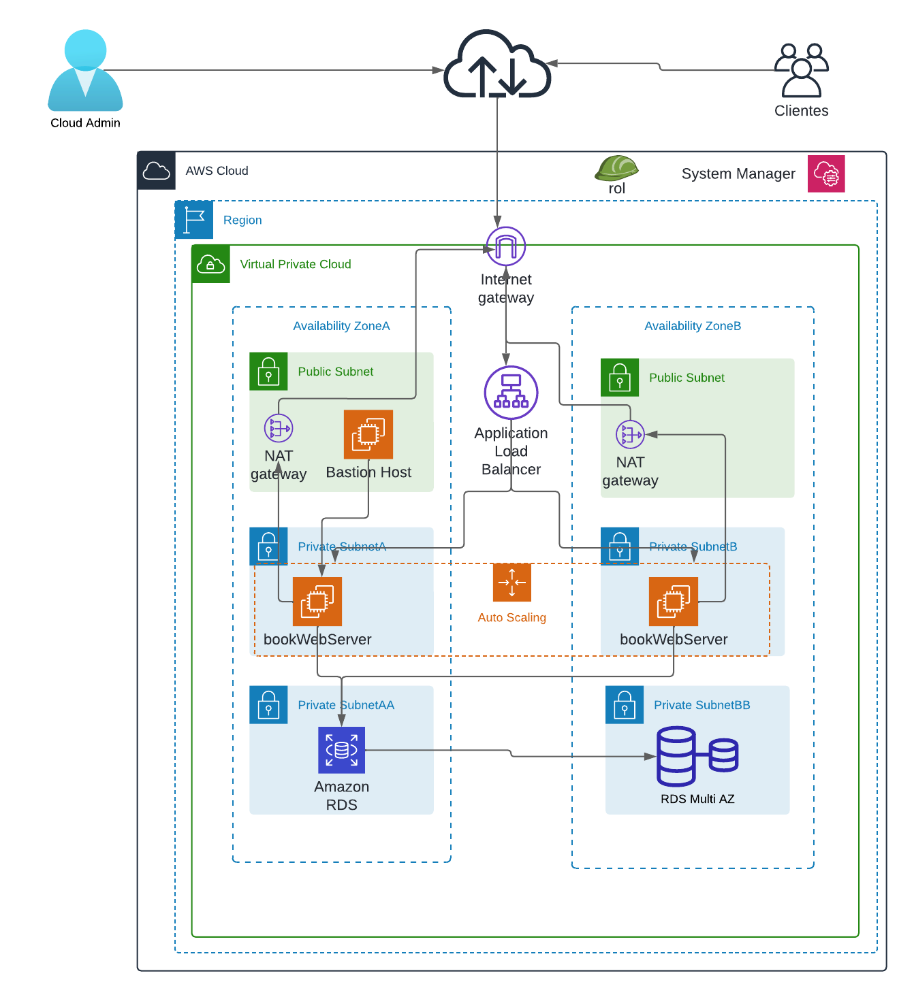

# Infraestructura como código utilizando AWS CloudFormation

En este proyecto vamos a lanzar una infraestructura en la nube usando las buenas prácticas del well-architect framework

1. Vamos a crear primero los templates usando la extensión .yml

- **Network Layer**
